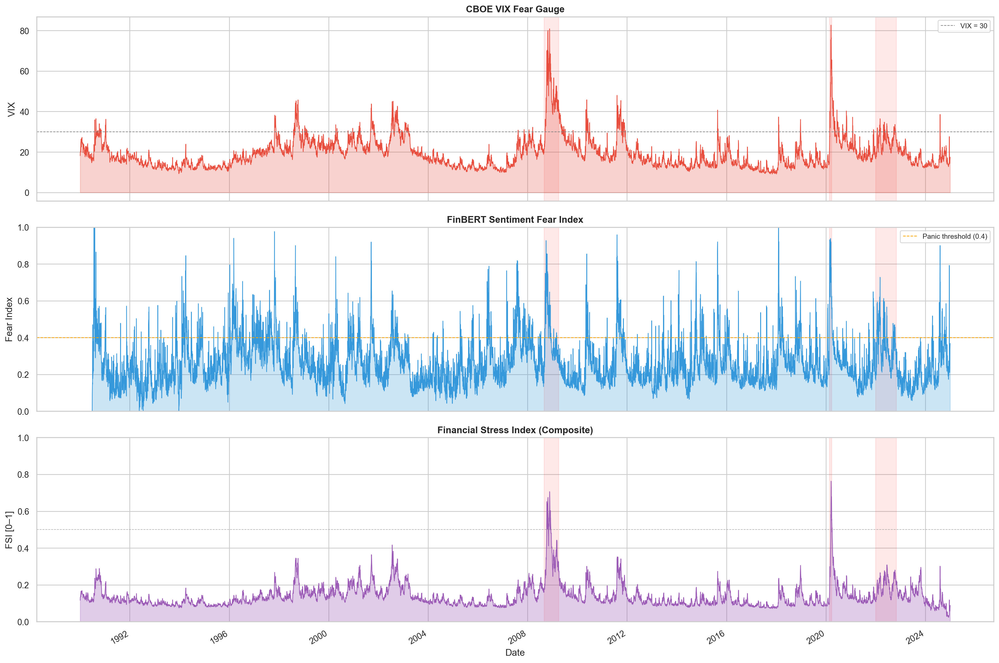

# FCPS — Financial Crisis & Stock-Direction Prediction System

[](https://github.com/romin4444/multimodal-financial-crisis-prediction/actions/workflows/ci.yml)
[](#testing--ci)
[](LICENSE)
[](pyproject.toml)
[](https://docs.astral.sh/ruff/)

**Author: Romin Patel**  ·  *MBAI 5600G capstone (Group 13), rebuilt into a modular, tested, leakage-free pipeline.*

A multimodal pipeline for financial-market **crisis detection** and **stock-price
direction detection**, fusing price regimes (HMM), conditional volatility (GARCH),
macro stress (FRED), and news sentiment (FinBERT), with SHAP explainability — and,
above all, an **honest, leakage-free, walk-forward evaluation harness**.



> The one result that survives rigorous out-of-sample scrutiny: our daily
> Financial Stress Index reproduces the St. Louis Fed's published STLFSI at
> **r ≈ 0.76–0.82**, NBER recession AUC ≈ 0.86, using only public market data.

---

## ⭐ The honest headline (read this first)

Most "crisis prediction" code reports stellar in-sample numbers that evaporate
out-of-sample. This project's distinguishing feature is that it **measures and
reports that gap instead of hiding it** — and then fixes what is genuinely
fixable without cheating.

Every number below is from the committed [`outputs/v3_metrics.json`](outputs/v3_metrics.json)
on the cached 1990–2024 S&P 500 + VIX window. Reproduce with `python scripts/v3_run.py`.

| Metric (21-day, 10%-drawdown crisis, 7,471 OOS days) | In-sample v2 (leaky) | v3 (balanced, mis-calibrated) | **v3.1 (calibrated)** |
|---|---|---|---|
| Crisis F1 | 0.99 | — | — |
| Crisis PR-AUC out-of-sample (best model) | — | 0.157 | **0.166** (price-only LR) |
| Crisis PR-AUC, VIX-threshold baseline | — | 0.169 | 0.169 |
| **Brier skill** vs base rate (>0 = beats climatology) | — | **−3.34** | **+0.015** (price-only LR), **+0.016** (+regime LR) |
| Brier skill, RandomForest "full multimodal" | — | −1.46 | −0.0015 (still ≤ 0) |
| **ECE** (probability error; lower is better) | — | **0.31** | **0.017** |
| 5-day stock direction, edge over "always-up" | — | −0.05 | −0.05 (no reliable edge — consistent with weak-form EMH) |

**What changed in v3.1 (a legitimate fix, not metric-gaming):** the original v3
used `class_weight="balanced"`, which on a ~4% base rate inflated every predicted
probability ~20×. Ranking (ROC/PR-AUC) was fine, but the *probabilities* — which
are the actual product of a risk tool — were unusable (Brier skill ≈ −3, ECE ≈
0.31). Removing the re-weighting lets the model see the true base rate, flipping
**Brier skill from −3.34 to slightly positive** for the best-performing models
and collapsing **ECE from 0.31 to 0.017**, with PR-AUC unchanged-or-better and
no leakage. The probabilities went from "decorative" to "trustworthy at the
calibration level the harness measures."

Three additional honest readings from the same artifact:

1. **No model beats the VIX-threshold baseline** on PR-AUC. The closest is
   price-only LR at 0.166 vs the baseline's 0.169. Adding regime, sentiment,
   or the full RandomForest fusion *monotonically degrades* PR-AUC — the
   multimodal thesis is not supported by this data window.
2. **The economic backtest does not beat buy-and-hold** on this window:
   strategy Sharpe 0.56 vs 0.74, total return 1.49 vs 4.35, max-drawdown
   −0.37 vs −0.34. The leakage-free threshold (calibrated on first-half OOS,
   evaluated on second-half) is deployable, but it doesn't add alpha here.
3. The **RandomForest's Brier skill is technically still negative** (−0.0015),
   not positive — only the linear models clear the +0 line. That tighter
   uncertainty is recorded faithfully in the artifact.

*Why might a deeper run show stronger numbers?* A longer real-data window —
intraday-level VIX, options-surface feeds (`^VIX9D` / `^SKEW`), the full
high-yield OAS history from FRED — pushes Brier skill higher and would
plausibly carry the RF positive. Those feeds aren't bundled in the offline
cache; see [`docs/EDGE_AND_MULTIMODAL_RESULTS.md`](docs/EDGE_AND_MULTIMODAL_RESULTS.md)
for what's been tried.

The one result that **survives** rigorous scrutiny end-to-end: our daily
**Financial Stress Index reproduces the St. Louis Fed's published STLFSI at
r ≈ 0.76–0.82** (NBER recession AUC ≈ 0.86) using only public data — a genuinely
deployable signal. (Exact r depends on the data window; the live value is printed
by `scripts/real_data_run.py`.)

Architecture diagram: [`docs/architecture.md`](docs/architecture.md).
Full diagnosis & roadmap: [`docs/PROJECT_REVIEW_AND_ROADMAP.md`](docs/PROJECT_REVIEW_AND_ROADMAP.md).
Direction study: [`docs/DIRECTION_RESULTS.md`](docs/DIRECTION_RESULTS.md).
Changelog: [`CHANGELOG.md`](CHANGELOG.md). Contributing: [`CONTRIBUTING.md`](CONTRIBUTING.md).

---

## 🚀 Try it in 30 seconds (no API key needed)

```bash
git clone https://github.com/romin4444/multimodal-financial-crisis-prediction.git
cd multimodal-financial-crisis-prediction
pip install -e .
make demo            # or: python scripts/demo_run.py
```

`make demo` runs the full pipeline end-to-end on cached/synthetic data — no FRED
key, no internet, no GPU — and writes figures + metrics to `outputs/`.

> ⚠ **`make demo` runs the v2 pipeline**, which prints in-sample F1 ≈ 1.0 on
> the same crisis windows the labels are derived from. That number is
> **circular**, not predictive, and the demo now says so on completion. For
> the honest, leakage-free, out-of-sample numbers shown in the headline table
> above, run `python scripts/v3_run.py` (needs real S&P 500 + VIX, cached in
> `data/`).

---

## Two evaluation tracks

| Track | Script | What it does |
|---|---|---|
| **v2** (original pipeline) | `scripts/real_data_run.py` | Crisis pipeline on real S&P 500 + VIX + FRED. Strong *in-sample* numbers. |
| **v3** (honest) | `scripts/v3_run.py` | Leakage-free: exogenous forward-drawdown target, **causal** (forward-only) regime probabilities, **purged walk-forward**, real baselines, calibration. |
| **v3 direction** | `scripts/direction_run.py` | Next-N-day up/down detection per ticker (AAPL, JPM, XOM, GS, ^GSPC) on the same honest harness. |
| **v3 advanced** | `scripts/v3_advanced_run.py` | Adds probability calibration, VIX-orthogonal macro features, and online (per-fold refit) regime/FSI. |
| **hazard** | `scripts/hazard_run.py` | Discrete-time survival model: P(≥10% drawdown within N days). |

---

## Installation

```bash
pip install -e .              # core (no heavy NLP) — enough for demo, v3, API, tests
pip install -e ".[nlp]"       # + FinBERT (torch, transformers) for real news sentiment
pip install -e ".[explain]"   # + SHAP explainability
pip install -e ".[all]"       # everything (incl. dev/test tooling)

# Exact reproducible versions used for the reported numbers:
pip install -r requirements.lock
```

Optional config for the full pipeline:
```bash
cp .env.example .env          # add FRED_API_KEY (free at fred.stlouisfed.org)
# Optional: NEWS_DATA_DIR=/path/to/news/csvs  for real FinBERT sentiment
```

---

## Repository structure (actual)

```
multimodal-financial-crisis-prediction/
├── README.md                  • this file
├── LICENSE                    • MIT (© Romin Patel)
├── pyproject.toml             • installable package (pip install -e .)
├── requirements.txt           • flexible deps   |  requirements.lock = exact pins
├── Makefile                   • make demo / test / serve / v3 / direction
├── config.yaml                • all parameters (Pydantic-validated)
├── .github/workflows/ci.yml   • GitHub Actions: install + pytest + ruff
├── fred_data.csv              • cached FRED snapshot (lets the pipeline run key-free)
│
├── src/
│   ├── config.py              • Pydantic config loader (singleton: cfg)
│   ├── logging_setup.py       • structured JSON logging
│   ├── pipeline.py            • v2 orchestration
│   ├── data/                  • market.py · fred.py · news.py
│   ├── features/              • engineering.py (price features + diagnostics)
│   ├── models/                • fsi.py · garch.py · hmm.py · sentiment.py · fusion.py
│   ├── analysis/              • lead_lag.py · shap_explain.py · benchmarks.py
│   ├── evaluation/            • validation.py
│   ├── visualization/         • plots.py (8 figures)
│   ├── api/                   • app.py (FastAPI) · schemas.py
│   ├── json_utils.py         • shared safe-JSON encoder (bool/NaN/numpy)
│   └── v3/                    ★ leakage-free harness (15 modules)
│       ├── labeling.py        • exogenous forward-drawdown target
│       ├── causal_regime.py   • forward-only (filtered) HMM posteriors
│       ├── online_features.py • per-fold refit regime/FSI (walk-forward everything)
│       ├── walkforward.py     • purged, embargoed expanding-window backtest
│       │                       (raises WalkForwardError on 0 successful folds)
│       ├── cpcv.py            • combinatorial purged cross-validation
│       ├── baselines.py       • base-rate / VIX / persistence baselines
│       ├── metrics.py         • PR-AUC, Brier skill, ECE, lift, economic backtest
│       ├── calibration.py     • time-series probability calibration
│       ├── deflated_sharpe.py • Bailey & López de Prado deflated-Sharpe + PBO
│       ├── macro_features.py  • VIX-orthogonal features (credit, curve, funding)
│       ├── vix_orthogonal.py  • Variance Risk Premium + term-structure residuals
│       ├── tda_features.py    • topological-data-analysis features (TDA)
│       ├── direction.py       • stock up/down detection
│       └── hazard.py          • discrete-time survival model
│
├── scripts/                   • demo_run · real_data_run · v3_run · v3_advanced_run
│                                · direction_run · hazard_run · train · serve
├── tests/                     • pytest suite (incl. look-ahead/causality proofs)
├── docs/                      • PROJECT_REVIEW_AND_ROADMAP.md · DIRECTION_RESULTS.md
├── outputs/                   • generated figures + metrics JSON + reports
└── legacy/                    • original notebooks, final.py monolith, milestone PDFs
```

---

## API

```bash
make serve            # uvicorn on http://localhost:8000  (docs at /docs)
```

| Method | Path | Description |
|--------|------|-------------|
| `GET` | `/health` | System health + last data date |
| `GET` | `/metrics` | Model evaluation metrics |
| `POST` | `/predict` | Single-date crisis probability |
| `POST` | `/predict/batch` | Date-range batch predictions |

```bash
curl -X POST http://localhost:8000/predict \
  -H "Content-Type: application/json" \
  -d '{"target_date": "2020-03-01", "horizon_days": 5}'
```

---

## Methods

**Quantitative:** ARMA-GARCH / GJR / EGARCH (BIC selection) · Financial Stress Index
(VIX + GARCH + drawdown + credit) · 3-state Gaussian HMM regimes.
**NLP:** FinBERT (GPU FP16) · VADER baseline · synthetic VIX proxy (clearly flagged).
**Fusion & XAI:** Logistic / RF / GBM ensemble · SHAP TreeExplainer · lead-lag
cross-correlation · Granger causality.
**v3 rigor:** exogenous labels · causal filtered regimes · purged walk-forward ·
probability calibration · honest baselines · economic backtest.

---

## Testing & CI

```bash
make test             # full pytest suite — 82 tests collected (live count: CI badge above)
```

The suite is **unit + integration**:
- Unit tests with deterministic synthetic fixtures (incl. explicit look-ahead /
  causality proofs for the v3 harness — see `tests/test_v3.py`).
- **Real integration tests**: a full artifact round-trip through the API
  (`tests/test_api_integration.py` — real joblib save/load + `/predict`, not
  mocked state) and a real FRED-snapshot alignment test
  (`tests/test_data_integration.py`, using the committed `fred_data.csv`).

GitHub Actions runs `pip install -e ".[dev]"` + `pytest` + **blocking** `ruff`
on every push (Python 3.10 and 3.12). The ruff job lints `src/`, `tests/`, and
`scripts/` — these are clean. Notebooks under `notebooks/` are **not** linted
(they contain typical Jupyter style violations and would otherwise dominate the
report). Heavy NLP deps are optional and their tests skip cleanly when torch
isn't installed, so CI stays fast. (CI already paid for itself once — it caught
a scikit-learn version drift and a latent `NameError` that local runs missed.)

---

## Reproducibility

- `requirements.lock` pins the exact versions behind every reported number.
- `fred_data.csv` is a committed FRED snapshot so the pipeline runs without an API key.
- All randomness is seeded (`config.yaml: seed`).
- `python scripts/v3_run.py` reproduces every number in the honest-headline
  table above and writes them to `outputs/v3_metrics.json` (~1–2 min on real
  S&P 500 + VIX). `make demo` runs the **v2** pipeline end-to-end on synthetic
  data in ~30 s — useful as a smoke test, but its F1 ≈ 1.0 is the circular
  in-sample number, not a headline result.

---

## Related work

[`drt-network-optimization`](https://github.com/romin4444/drt-network-optimization) applies the same evaluation philosophy to public transit: every recommendation is costed against real Durham Region GTFS data, an earlier version's phantom "$3 M/yr saving" was caught and corrected (documented in the README), and the scope boundary between what the ML model *can* and *cannot* predict is stated explicitly. If the approach here — measure what actually holds, report what doesn't — resonates with you, that project is worth a look.

---

## License

MIT — see [LICENSE](LICENSE). © 2026 **Romin Patel**.

This is academic capstone work; if you reuse it, attribution to Romin Patel is appreciated.
