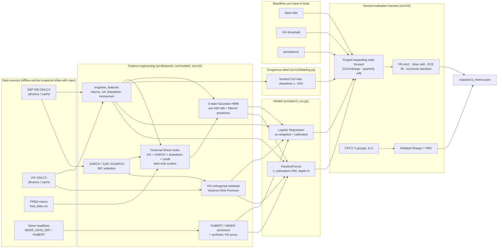

# FCPS architecture

A one-page tour of how data flows through the pipeline. Rendered inline by
GitHub's mermaid support — no external image needed.

## Data → features → models → fusion → evaluation

## Where to look in the code

| Stage | File | What it does |
|---|---|---|
| Market data | `src/data/market.py` | yfinance fetch + cached snapshot |
| Macro data | `src/data/fred.py` | FRED snapshot + daily alignment |
| News (optional) | `src/data/news.py` | NEWS_DATA_DIR → FinBERT |
| Price features | `src/features/engineering.py` | returns, vol, drawdown, momentum |
| GARCH | `src/models/garch.py` | ARMA-GARCH/GJR/EGARCH + BIC selection |
| FSI | `src/models/fsi.py` | train-only scalers, validated vs STLFSI |
| HMM (offline) | `src/models/hmm.py` | n-state selection via BIC |
| HMM (online, per-fold) | `src/v3/online_features.py` | refit + filtered posteriors |
| Sentiment | `src/models/sentiment.py` | FinBERT + VADER + VIX proxy |
| Exogenous label | `src/v3/labeling.py` | forward-drawdown crisis target |
| Walk-forward | `src/v3/walkforward.py` | purged, embargoed, fails loudly on 0 folds |
| CPCV | `src/v3/cpcv.py` | combinatorial purged CV |
| Calibration | `src/v3/calibration.py` | isotonic / sigmoid time-series calibration |
| Baselines | `src/v3/baselines.py` | base-rate / VIX / persistence |
| Metrics | `src/v3/metrics.py` | PR-AUC, Brier skill, ECE, lift, econ backtest |
| Deflated Sharpe | `src/v3/deflated_sharpe.py` | Bailey & López de Prado |
| API | `src/api/app.py` | FastAPI `/predict`, `/predict/batch`, `/metrics`, `/health` |
